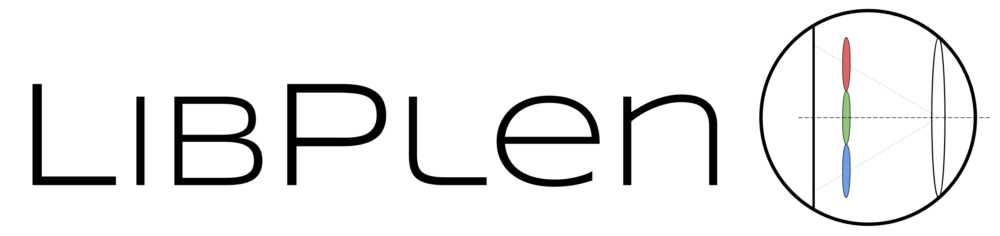

---

Quick Start
===========

### Pre-requisites

The libpleno library has a light dependency list:

 * [Eigen] version 3, a modern C++ matrix and linear-algebra library,
 * [boost] version 1.54 and up, portable C++ source libraries,
 * [OpenCV] version 3.2, a collection of algorithms and sample code for various computer vision problems,
 * [libv], a general purpose computer vision library developed at Pascal Institute (used for graphic and serialization),
 * [lma], a non-linear optimization library implementing the Levenberg Marquardt Algorithm,
 
and was compiled on:
  * Ubuntu 18.04.4 LTS.
  
### Compilation & Installation 

If you are comfortable with Linux and CMake and have already installed the prerequisites above, the following commands should install libpleno on your system.

```
mkdir build && cd build
cmake .. -DUSE_OPEN_MP=true
make -j6
sudo make install
```

Applications
============


Currently available applications using the libpleno:
 * [COMPOTE](http://gitlab.ip.uca.fr/mla-dev/compote) (Calibration Of Multi-focus PlenOpTic camEra), a collection of tools to pre-calibrate and calibrate a multifocus plenoptic camera.
 * ...

Citing
======

If you use libpleno in an academic context, please cite the following publication:

	@inproceedings{Labussiere2020,
		author = {Labussi{\`{e}}re, Mathieu and Teuli{\`{e}}re, C{\'{e}}line and Bernardin, Fr{\'{e}}d{\'{e}}ric and Ait-Aider, Omar},
		booktitle = {Proceedings of the IEEE Computer Society Conference on Computer Vision and Pattern Recognition},
		title = {{Blur Aware Calibration of Multi-Focus Plenoptic Camera}},
		year = {2020}
	}


License
=======

libpleno is licensed under the GNU General Public License v3.0. Enjoy!

[Ubuntu]: http://www.ubuntu.com
[CMake]: http://www.cmake.org
[CMake documentation]: http://www.cmake.org/cmake/help/cmake2.6docs.html
[git]: http://git-scm.com
[Eigen]: http://eigen.tuxfamily.org
[libv]: http://gitlab.ip.uca.fr/libv/libv
[lma]: http://gitlab.ip.uca.fr/libv/lma
[OpenCV]: https://opencv.org/
[Doxygen]: http://www.stack.nl/~dimitri/doxygen/
[boost]: http://www.boost.org/

---
